# Etape 1

## Culture générale et technique

### Configuration matérielle dans VirtualBox

#### Quelle est la configuration réseau utilisée par défaut ?

Par défaut, VirtualBox utilise le ***mode d'accès réseau NAT*** avec une interface de type `Intel PRO/1000 MT Desktop (82540EM)` et l'***adresse mac*** suivante pour l'***interface réseau*** : `0800279E1C1A`.  

Cette configuration permet d'ajouter une ***interface réseau ethernet*** dans notre machine virtuelle nommée `enp0s3`.  Elle permet la connection entre le réseau du système hôte et celui de la machine virtuelle.

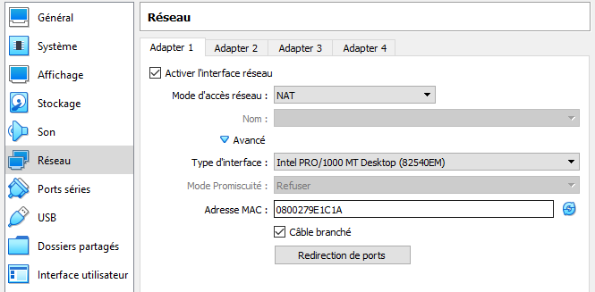

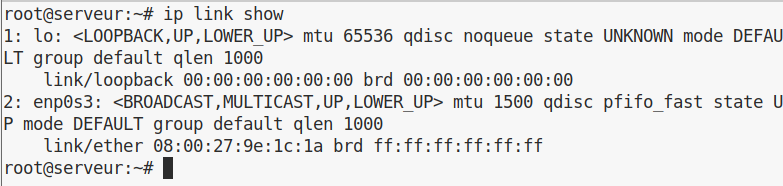

#### Quel est le nom du fichier ***XML*** contenant la configuration de votre machine ?

Le nom du fichier est `sae203.vbox` (mais il est de type ***XML***). Il est situé dans le dossier de la machine virtuelle (au même endroit que le ***disque virtuel***).  
On peut y accéder de cette manière:  

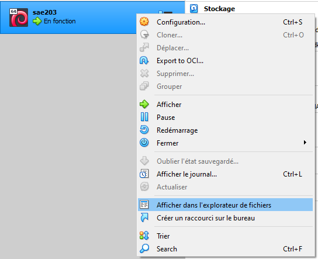

#### Qu’est-ce que la RAM ?

***RAM*** est l'abréviation de « ***Random Access Memory*** » que l'on appelle aussi ***mémoire vive***.
La mémoire vive est la mémoire à court terme d'un ordinateur.
Elle permet au processeur de stocker temporairement les données dont il a besoin pour par exemple lancer un programme.

#### Qu’est-ce que signifie “64-bits” dans “Debian 64-bit” ?

**64 bits** désigne la *taille des mots manipulés par le processeur*, il nous indique ainsi l'architecture du processeur compatible avec le programme (ou OS dans ce cas).  
Cela a une influence sur la taille de la ***RAM*** que peut gérer le processeur (la plupart du temps *max 4Go* pour les processeurs **32 bits**).  

Un programme **64 bits** pourra s'executer seulement avec une architecture de processeur de type **x86-64** (**64 bits**), un programme **32 bits** pourra s'executer avec une architecture de processeur de type **x86-64** et **x86** (**32 bits**)

### Installation OS de base

#### Qu’est-ce qu’un fichier iso bootable ?

Un ***fichier ISO*** aussi appelé ***image ISO*** est une copie complète de ce qui est stocké sur un disque optique physique comme par exemple un CD ou un DVD. On peut alors utiliser comme s’il s’agissait d’un disque optique même si c’est enregistré sur le disque dur.

Un ***fichier ISO bootable*** contient les composants logiciels nécessaires pour être démarré directement au chargement avant le chargement du système d'exploitation.

#### Qu’est-ce que MATE ? GNOME ?

***MATE*** et ***GNOME*** sont des *environnements de bureau GNU/Linux*. Un environnement de bureau est l'interface utilisateur en mode graphique.

#### Qu’est-ce qu’un serveur web ?

Au sens physique du terme, un ***serveur web*** est une machine qui (entre autres) stocke du contenu web pour l'envoyer au client via Internet (public) ou Intranet (privé) lorsque celui ci en fait la ***demande***.

Au sens logiciel du terme, un serveur web est un ensemble de logiciels permettant le traitement et la réponse aux requêtes (***serveur HTTP***), la gestion des ressources etc. On peut par exemple citer **Apache**.

#### Qu’est-ce qu’un serveur SSH ?

Un ***serveur SSH*** est un serveur permettant la connection d'un programme client (sur un ordinateur) à une machine distante de **manière sécurisée** (même sur un réseau comme Internet). On pourra ensuite "manipuler" le système à distance. Le serveur SSH est basé sur le ***protocole SHH***.

#### Qu’est-ce qu’un proxy (ou serveur mandataire) ?

Un ***serveur mandataire*** ou ***proxy*** est un serveur permettant de relayer les requêtes entre un client et un serveur (*"il se positionne entre les deux intermédiaires"*). Ils peuvent être utilisés notamment pour **mettre en cache** des données, anonymiser, effectuer de la **journalisation** (logging), **filtrer des requêtes** etc.

## Travail réalisé et justifications

### Configuration matérielle dans VBox

Ici, il s'agit du nom dans VirtualBox:

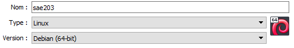

Ici, il s'agit du nom interne de la machine:

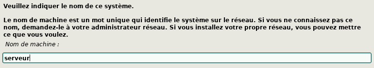

### Installation de l'OS

#### Création du compte super-utilisateur *root*

Nous avons choisi un mot de passe court qui pourra être changé ultérieurement au besoin, afin de faciliter les manipulations du système.

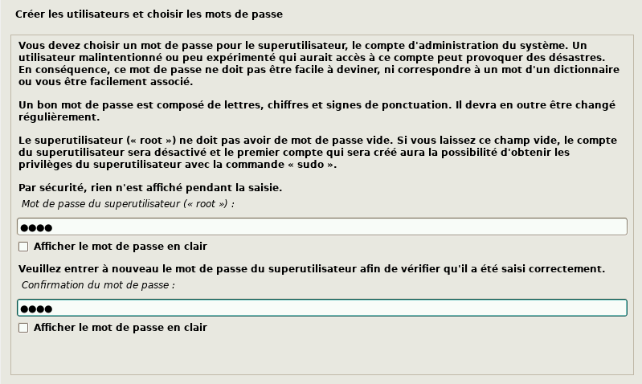

#### Création d'un compte utilisateur courant

L'installeur "oblige" à créer un second compte pour l'utilisation courante du système, nous choisissons un nom simple:

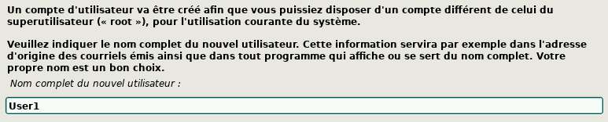

Il ne faut pas confondre le nom complet avec le *login* (qui lui permet notamment de se connecter):

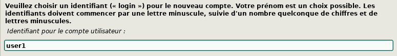

#### Partitionnement des disques

L'installeur nous demande comment souhaitons nous partitionner le disque. Le ***partitionnement*** permet de découper virtuellement le disque dur en plusieurs secteurs afin de séparer les données (séparer programmes et fichiers multimédia, séparer plusieurs OS...)  
Cela peut permettre d'améliorer les performances car le système sait dans quel secteur se situent les données, ainsi que la sécurité car elles sont cloisonnées.  
Comme indiqué dans les consignes, nous utiliserons donc une seule partition.

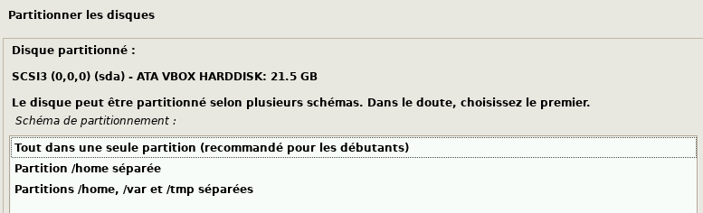

#### Configuration du gestionnaire de paquet

Le *gestionnaire de paquet* sur ***Debian*** est ***apt***. Il permet de gérer le téléchargement, l'installation, la mise à jour et la désinstallation des logiciels.
Il faut préciser au gestionnaire de paquets quelle source/serveur il va utiliser pour récupérer ses paquets (un dépôt distant).  
Nous choisissons le dépôt conseillé.

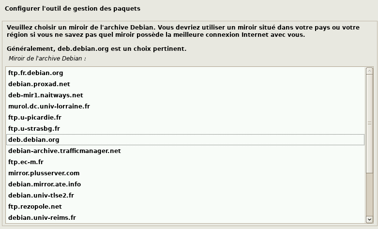

#### Proxy

Ici, nous laissons vide car nous travaillons sur nos machines personnelles (voir la réponse à la question [qu'est ce qu'un proxy pour plus d'infos](#quest-ce-quun-proxy-ou-serveur-mandataire)):

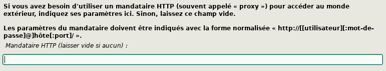

#### Programme de démarrage

Le ***programme de démarrage/d'amorçage*** permet de lancer (et choisir) le système d'exploitation  au démarrage de la machine, nous devons donc sélectionner `oui`.

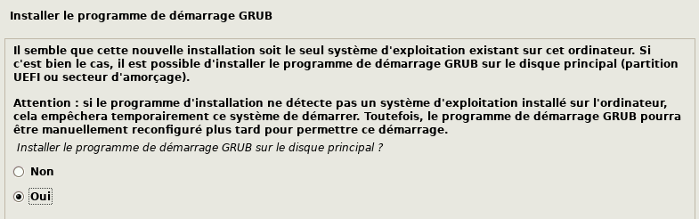

#### Installation terminée !

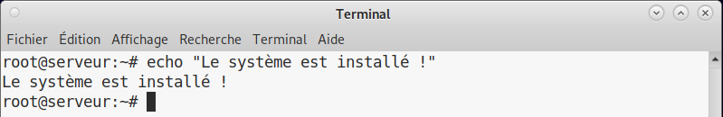

### Installation des VBoxGuestAdditions

Normalement à faire plus tard, mais fait pour "travailler plus confortablement en attendant" (*cette partie sera bien sûr aussi ajoutée dans le rapport d'étape concerné*).

#### Etape 1

Cliquer sur insérer l'image CD des additions invités dans le menu VBox.

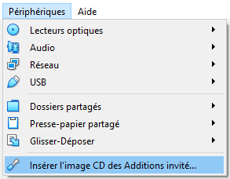

#### Etape 2

Installation des outils de compilation et des fichiers d'en-têtes:

```bash
sudo apt update
sudo apt install build-essential dkms linux-headers-$(uname -r)
```

Montage du CD virtuel dans le dossier `/mnt/vbox-additions` (cela permet d'attacher le système de fichier du CD à l'arborescence de fichiers du système):

```bash
sudo mkdir -p /mnt/vbox-additions
sudo mount /dev/cdrom /mnt/vbox-additions
```

Installation des suppléments invités:

```bash
cd /mnt/vbox-additions
sudo ./VBoxLinuxAdditions.run
```

#### Etape 3

Redémarrage de la machine via `sudo shutdown -r now`.
