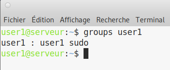
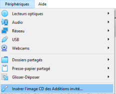
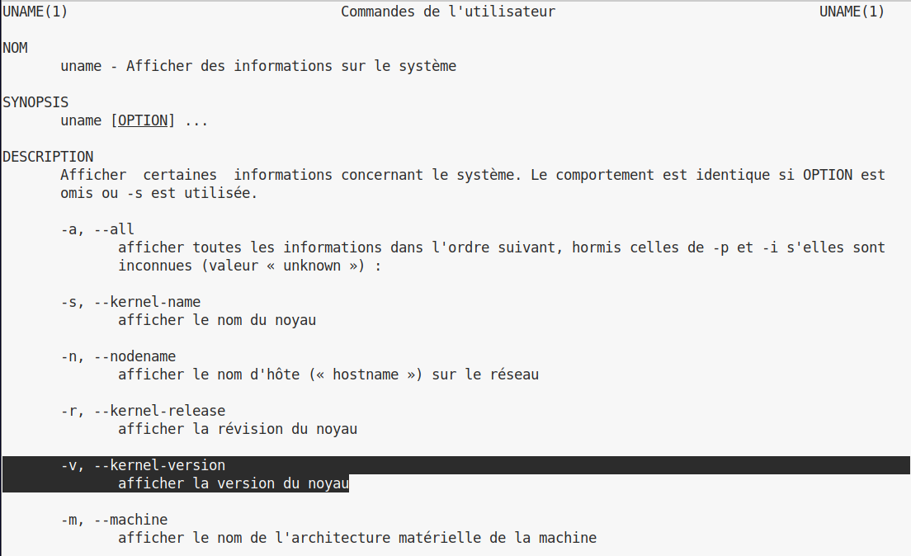
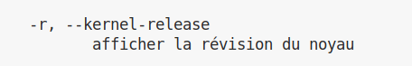
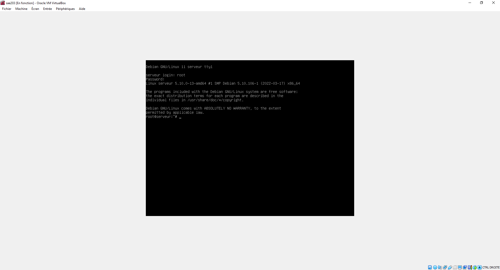
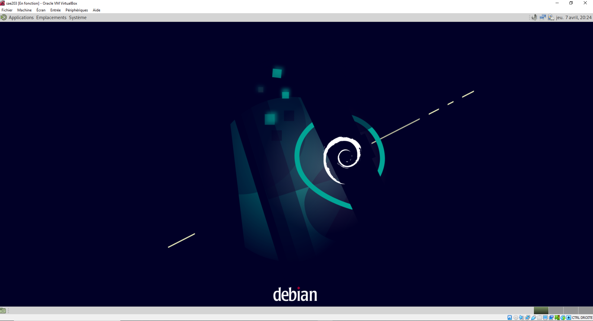
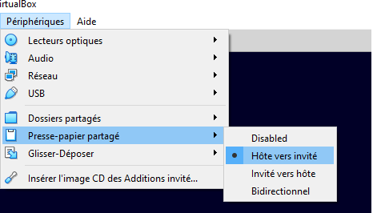
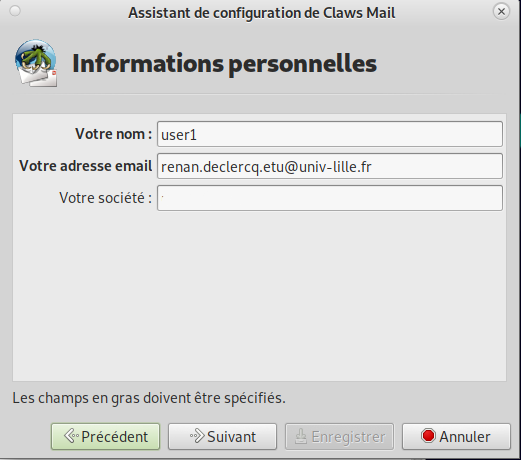
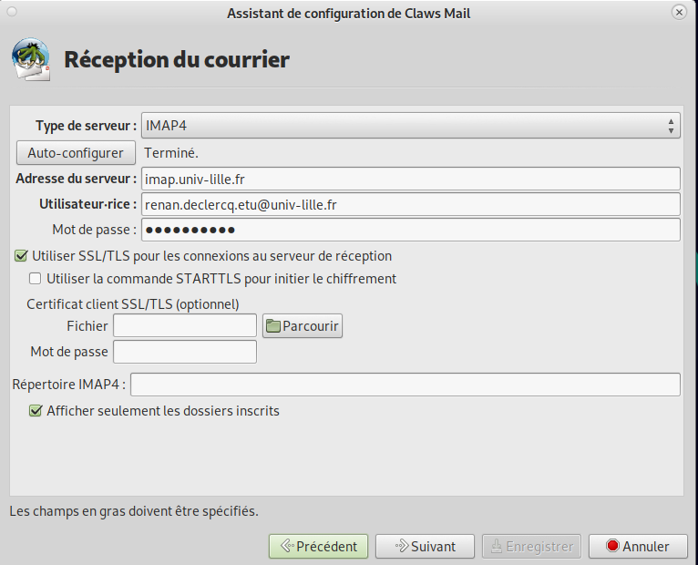
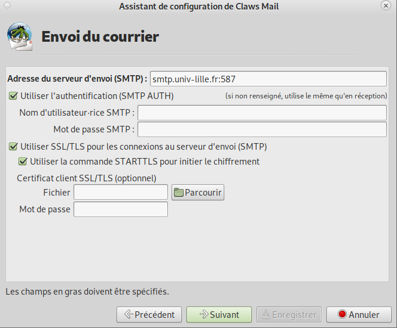

# Etape 2

## Accès `sudo` pour user

Avec un compte **root**: ajouter un nouvel utilisateur "user" au groupe **sudo** :

```bash
adduser user sudo
```

La commande `sudo` permet d'executer n'importe quelle commande administrateur sur le système (grâce aux identifiants de l'utilisateur concerné et non ceux de **root**).

L'utilisation de cette commande est seulement "autorisée" aux groupes ou utilisateurs ajoutés dans le fichier sudoers (`/etc/sudoers`), par défaut le groupe **sudo** y est présent.

### Comment peux-ton savoir à quels groupes appartient l’utilisateur user ? (**Q3**)

```bash
groups user
```



## Installation de quelques outils utiles

```bash
apt install xterm vim curl git sqlite3 build-essential dkms linux-headers-$(uname -r)
```

### À quoi servent les paquets installés ? (**Q4**)

- **linux-headers-$(uname -r) ->** Installe les Linux Headers (en têtes) pour le ou les noyaux ciblés, ils servent à la compilation des modules/drivers (notamment pour la compilation de C). [^linux-headers]

- **xterm ->** Xterm permet d'utiliser un terminal émulé. [^xterm]

- **vim ->** Vim est un éditeur de texte, c'est-à-dire un logiciel permettant la manipulation de fichiers texte. [^vim]

- **curl ->** Curl littéralement client URL request library, permet de récupérer le contenu d'une ressource distante accessible par un réseau informatique (via URL) [^curl]

- **git ->** Git est un logiciel de gestion de versions décentralisé permettant de garder un historique des modifications d'un projet, avec un service comme **Gitlab**, il facilite grandement la collaboration sur des projets informatiques. [^git]

- **sqlite3 ->** Sqlite est un moteur de base de donnée utilisant le langage SQL. [^sqlite3]

- **build-essential ->** Build-essential permet la compilation de C/C++. [^build-essential]

- **dkms ->** Dkms ou Dynamic Kernel Module Support est un framework permettant la mise à jour de noyau modules soit la gestion dynamique des modules noyau. [^dkms]

[^linux-headers]: <https://wiki.gentoo.org/wiki/Linux-headers>
[^xterm]: <https://fr.wikipedia.org/wiki/Xterm>
[^vim]: <https://fr.wikipedia.org/wiki/Vim>
[^curl]: <https://fr.wikipedia.org/wiki/CURL> et <https://curl.se/>
[^git]: <https://fr.wikipedia.org/wiki/Git> et <https://git-scm.com/>
[^sqlite3]: <https://www.sqlite.org/index.html>
[^build-essential]: <https://packages.debian.org/fr/sid/build-essential>
[^dkms]: <https://fr.wikipedia.org/wiki/Dynamic_Kernel_Module_Support>

## Installation des suppléments invités

1. Installation des outils de compilation et des fichiers d'en-têtes (fait à l'étape [installation de quelques outils utiles](#installation-de-quelques-outils-utiles))

2. Périphériques › Insérer l’image CD des additions invités:

    

3. Monter le CD:

    ```bash
    sudo mount /dev/cdrom /mnt
    ```

4. Installer les suppléments:

    ```bash
    sudo /mnt/VBoxLinuxAdditions.run
    ```

5. Redémarrer

    ```bash
    sudo shutdown -r now
    ```

    L'option `-r` permet de redémarrer

6. Prendre un instantané

    Un instantané est l'enregistrement d'une machine virtuelle à un instant "T" pour repartir de cet état plus tard. [^snapshot-vbox]

    [^snapshot-vbox]: <https://www.virtualbox.org/manual/ch01.html#snapshots>

### Quel est le noyau Linux utilisé par votre VM ? Comment l’avez-vous trouvé ? (**Q5.1**)

```bash
man uname
```



---

On remarque que la commande `uname` est utilisée lors de l'installation des linux-headers avec la commande ci-dessous :

```bash
apt install linux-headers-$(uname -r)
```



---

```bash
uname -sr
```

Le résultat de cette commande est `Linux 5.10.0-13-amd64`, il s'agit du noyau Linux utilisé par la VM et plus précisément sa version.  
`amd64` fait référence aux architectures processeurs compatibles avec le noyau (il désigne les processeurs AMD64 et Intel 64, donc en 64 bits). [^amd64]

On peut également obtenir ces informations à l'aide de `cat /proc/version`.

[^amd64]: <https://www.debian.org/ports/amd64/index.fr.html>

### À quoi servent les suppléments invités ? Donner 2 principales raisons de les installer. (**Q5.2**)

Les additions invités sont un ensemble de pilotes de périphériques qui servent à améliorer l'interaction entre la machine virtuelle et la machine physique (l'hôte) dans laquelle elle est installée.

1. Les additions invités détectent l'écran de la machine physique permettant une adaptation adéquate à la résolution de l'écran de la VM.

    Avant (gauche) et après (droite) les suppléments invité :

    

    

2. Cela permet de copier/coller du texte ou des images via **Périphériques > Presse-papier** partagés ou de créer des dossiers partagés entre la machine physique et la machine virtuelle.

    

### À quoi sert la commande `mount` (dans notre cas de figure et dans le cas général) ? (**Q5.3**)

La commande `mount` permet de monter/d'attacher une partition ou un périphérique à un répertoire dans le système de fichier depuis lequel on pourra accéder aux données.  [^mount]
En effet, sous les systèmes Unix, pour que les fichiers soient accessibles il doivent être situés dans la grande arborescence de fichiers commençant à la racine `/`.

Nos périphériques sont donc des fichiers dans `/dev/`. Dans notre cas de figure, notre CD virtuel est désigné par `/dev/cdrom`.  
Ainsi, nous avons utilisé la commande `mount` pour monter le CD des additions invité dans le dossier `mnt` (point de montage) de cette manière: `mount /dev/cdrom /mnt`. A présent, on peut accéder à son contenu.

[^mount]: <https://fr.wikipedia.org/wiki/Point_de_montage>

## Installation claws-mail

Installation de Claws-mail:

```bash
apt install claws-mail
```

Configuration claws-mail:

```bash
claws-mail &
```



### Réception du courrier

Choisir type de serveur : IMAP4 puis cliquer sur **auto-configurer**, puis mettre son mot de passe.

On laisse cochée la case utiliser SSL/TLS car elle permet de chiffrer la connection entre le client et le serveur.



IMAP [^imap] est l'un des protocoles d'accès aux courriers électroniques depuis un serveur de messagerie, il effectue une synchronisation des messages et dossiers entre le serveur et la machine locale.  
Il existe également le protocole POP, mais il est moins pratique; il ne réplique pas les changements sur le serveur (telle que le déplacement dans des dossiers, marquer lu...), de plus, par défaut, il supprime les message du serveur après leur récupération (il effectue un "simple" transfert). [^imap-vs-pop]

[^imap]: <https://fr.wikipedia.org/wiki/Internet_Message_Access_Protocol>
[^imap-vs-pop]: <https://support.mozilla.org/fr/kb/differences-imap-pop3>

### Envoi du courrier



Pas de configuration spécifique à faire, tout semble correct par défaut.  
Cependant nous pouvant expliquer ce qu'est SMTP, il s'agit du protocole de communication utilisé pour envoyer les courriers électroniques vers les serveurs de messagerie.  
C'est lui qui s'occupe de l'envoi des emails mais il ne permet pas leur récupération à distance (depuis un serveur).  
Le port 587 indique qu'on utilise une communication chiffrée (SSL/TLS). [^smtp]

[^smtp]: <https://fr.wikipedia.org/wiki/Simple_Mail_Transfer_Protocol>

## Précision sur le Proxy

Pour le moment, nous n'avons rien trouvé à ajouter sur cette partie. On peut retrouver la définition d'un proxy dans le précédent rapport.
