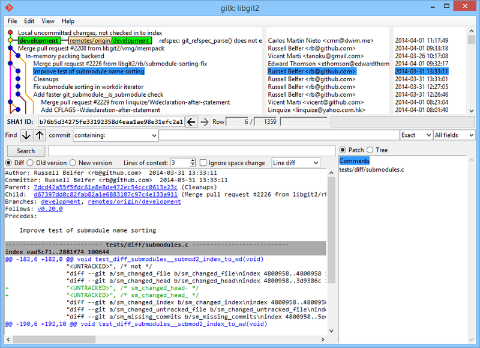
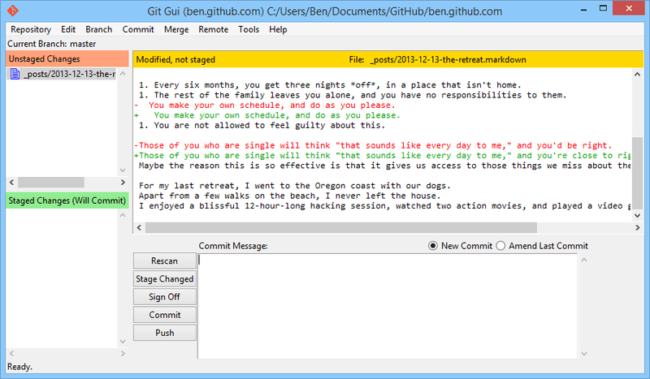
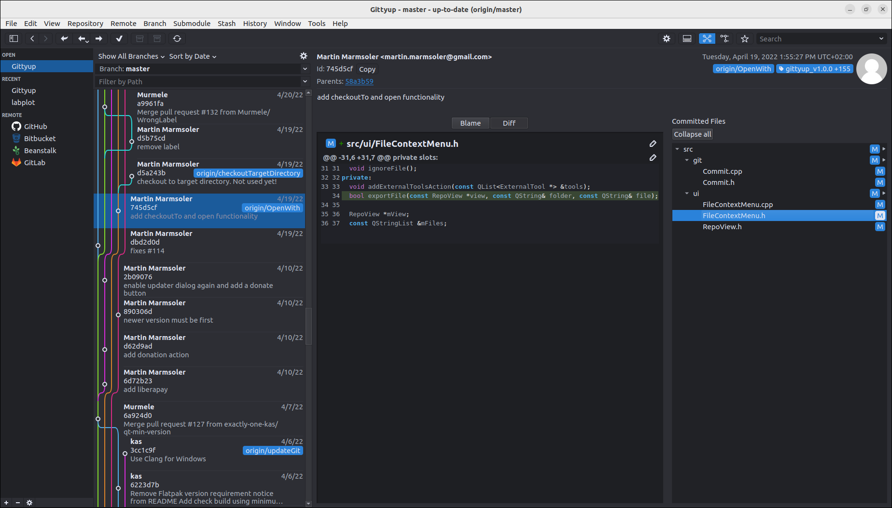
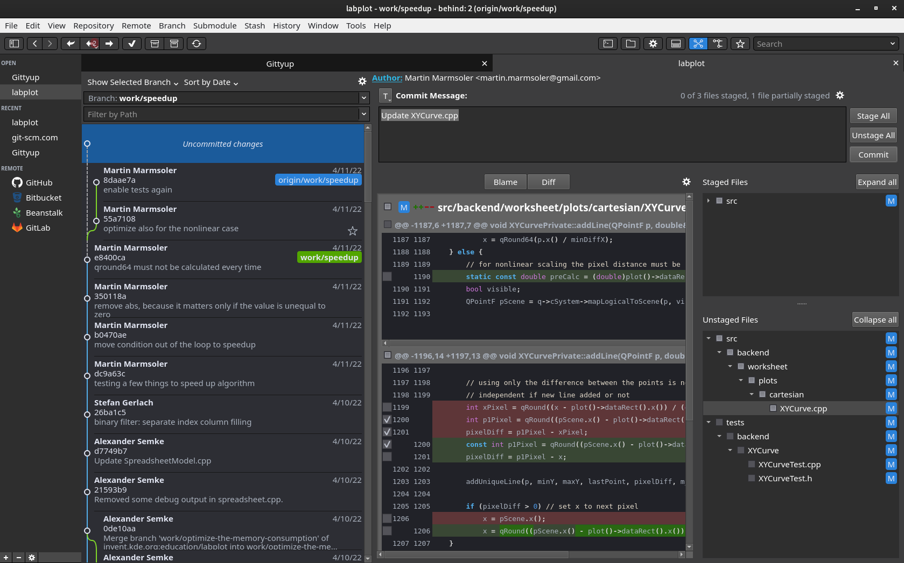
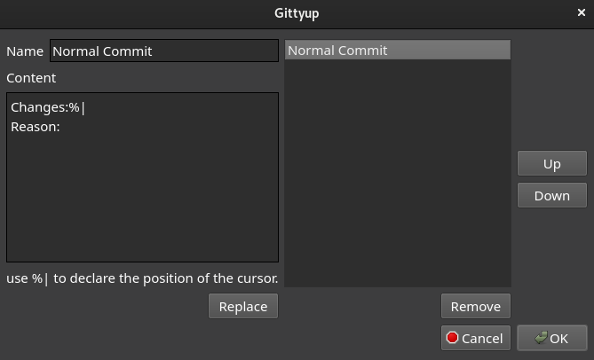

# Etape 3

## Préliminaire

```bash
git config --global user.name "Prénom Nom"
git config --global user.email "votre@email"
git config --global init.defaultBranch "master"
```

Ces commandes modifient le fichier `.gitconfig` (qui est donc le fichier de config de git). On peut également le modifier directement manuellement (format INI), il est situé dans le dossier de l'utilisateur. [^gitconfig].

Son format est le suivant (nous avons bien sur remplacé par nos vraies informations en le configurant):

```ini
[user]
    name = Prénom Nom
    email = votre@email.fr
[init]
    defaultBranch = master
```

[^gitconfig]: <https://git-scm.com/book/fr/v2/Personnalisation-de-Git-Configuration-de-Git>

La première commande permet de définir le nom et prénom de l'utilisateur de git, c'est le nom qui sera indiqué dans les commits. La deuxième commande fait la même chose pour l'adresse email.

### Quels sont les logiciels `gitk` et `git-gui` ?

`Gitk` et `git-gui` sont des interfaces graphiques fournies avec git.  
`Gitk` est un outil de visualisation d’historique, il permet notamment d’afficher l’historique de votre dépôt sous forme d’arbre, on peut notamment voir la différence entre les commits.  
`Git-gui` est un outil permettant d’effectuer les actions de base de git tels que les commits, la création de branches, l'envoi sur un dépôt distant... et cela sans passer par des lignes de commande. [^gitk-git-gui]

> "gitk and git-gui are examples of task-oriented tools. Each of them is tailored for a specific purpose (viewing history and creating commits, respectively), and omit the features not necessary for that task." [^gitk-git-gui]

[^gitk-git-gui]: <https://git-scm.com/book/fr/v2/Annexe-A%3A-Git-dans-d%E2%80%99autres-environnements-Interfaces-graphiques>





### Quelle commande avez-vous utilisé pour installer ces deux applications ?

```bash
sudo apt install gitk git-gui
```

On utilise le [package manager APT](https://en.wikipedia.org/wiki/APT_(software)) pour télécharger les paquets depuis un dépôt Debian et les installer.

## Installons autre chose et comparons

Nous avons choisi d'installer `Gittyup` (son [repo Github](https://github.com/Murmele/Gittyup) et [son site](https://murmele.github.io/Gittyup/)).



### Pourquoi avez-vous choisi ce logiciel ?

La première raison pour laquelle nous avons choisi ce logiciel est qu'il permet de rassembler la majorité des fonctionnalités de `git-gui` ("outil de commit") et `gitk` (simple visualiseur de l'historique du projet). On peut ainsi faire ces actions au même endroit ! Il possède également d'autres avantages et fonctionnalités, qui sont logiquement présentées dans [les fonctionnalités et avantages](#fonctionnalités-et-avantages-fortement-lié).

Pour trouver des alternatives à ces deux logiciels nous nous sommes aidés des sites suivants:

- [Git SCM - GUI Clients](http://git-scm.com/download/gui/linux)
- [AlternativeTo](https://alternativeto.net)
- [Github](https://github.com/)
- [Comparaison des interfaces graphiques Git](https://git.wiki.kernel.org/index.php/InterfacesFrontendsAndTools#Graphical_Interfaces_-_FLOSS) (mais peu mis à jour)
- [Slant](https://www.slant.co/)

Nous étions intéressés par `Gitahead` mais il n'est plus en développement actif, alors nous nous sommes penchés sur un fork/continuation de ce dernier, qui est donc `Gittyup`.

### Comment l’avez vous installé ?

#### Préambule

Pour l'installation, nous avons suivi [les instructions sur le dépôt Github du logiciel](https://github.com/Murmele/Gittyup#how-to-install).

Nous avons choisi de ne pas le [construire depuis les sources](https://github.com/Murmele/Gittyup#how-to-build) car le processus nous semble trop complexe à notre niveau et avec nos connaissances. Nous pensons qu'il n'est pas très enrichissant de copier-coller des commandes sans rien n'y comprendre. Nous avons donc choisi une solution plus simple mais que nous sommes sûr de comprendre.

#### Téléchargement et installation de Flatpak

Pour installer `Gittyup` sur Linux, il est nécessaire d'installer [`Flatpak`](https://www.flatpak.org/) [^flatpak], nous avons donc téléchargé le fichier `.deb` de `Flatpak` depuis [le dépôt Debian](https://packages.debian.org/bullseye/amd64/flatpak/download) [^trouver-deb-flatpak], puis nous l'avons installé comme ceci:

```bash
curl http://ftp.fr.debian.org/debian/pool/main/f/flatpak/flatpak_1.10.7-0+deb11u1_amd64.deb --output flatpak.deb

sudo apt install --fix-broken ./flatpak.deb
# On utilise --fix-broken pour aussi récupérer les dépendances du flatpak
```

[^flatpak]: De manière très succincte, Flatpak est un moyen de distribuer des applications en faisant abstraction de la distribution Linux utilisée <https://fr.wikipedia.org/wiki/Flatpak>

[^trouver-deb-flatpak]: Nous n'avons pas réussi à trouver directement de fichier `.deb` pour flatpak.

#### Téléchargement et installation de Gittyup

Puis nous avons [téléchargé](https://github.com/Murmele/Gittyup/releases/tag/stable) et installé `Gittyup`

```bash
wget https://github.com/Murmele/Gittyup/releases/download/stable/Gittyup.flatpak

flatpak install Gittyup.flatpak

# Pour le lancer (nous essayerons de trouver un moyen de configurer un raccourci pour le prochain rapport)
flatpak run com.github.Murmele.Gittyup
```

### Comparaison avec celui inclus avec git

#### Fonctionnalités et avantages (fortement liés)

- Possède une interface graphique très épurée, conviviale mais très complète ([voir la capture d'écran plus haut⬆](#installons-autre-chose-et-comparons)). Nous trouvons cette dernière bien plus intuitive que celle de `gitk` ou `git-gui`.

- Visualisation graphique claire et compéhensible des branches et commits

- Visualisation complète des informations concernant un commit (son autrice/auteur, sa branche, sa date, les différences de fichiers, les fichiers concernés etc.)

- Possibilité d’effectuer pratiquement toutes les actions faisables en lignes de commandes avec git: stage, unstage, commit, gestion des branches, gestion des dépôts distants, gestion des tags, des stash ("sauvegarde d'un répertoire de travail sale" sans le commit pour autant[^git-stash]) etc.



[^git-stash]: <https://git-scm.com/docs/git-stash/fr>

- Voir les différences entre les fichiers et "visualisation blame" pour voir qui à apporté quelle modification aux lignes du fichier en dernier [^git-blame]. Le tout en fonction du commit sélectionné ou bien de la zone de stage etc.

[^git-blame]: <https://www.git-scm.com/docs/git-blame>

- Possibilité de créer des modèles (templates) de commits ce qui permet d'aller plus vite et d'être plus régulier



- Fonctionnalités pour chercher les commits en fonction notamment du nom/chemin du fichier modifié


- Il est open source, on peut donc participer au développement, ce qui est peut être intéressant si on trouve un petit bug qu’on aimerait corriger

- Son développement est encore actif


#### Inconvénients

- Pas de documentation sur l'utilisation du logiciel (mais très simple à comprendre)
- Difficile de dire si le développement du logiciel continuera dans le temps (étant déjà une continuation de [Gitahead](https://github.com/gitahead/gitahead) dont le développement est arrêté). Les contributeurs sont peu nombreux mais en faisant parler un peu plus de lui, il pourrait en attirer quelques uns.
- Installation assez fastidieuse et lente sans passer par un package manager. Le logiciel est d'ailleurs seulement délivré avec [Flatpak](https://www.flatpak.org/).
- Sans utilisation prolongée et approfondie du logiciel sur des projets concrets, nous ne lui trouvons pas pour le moment d'autres inconvénients.
