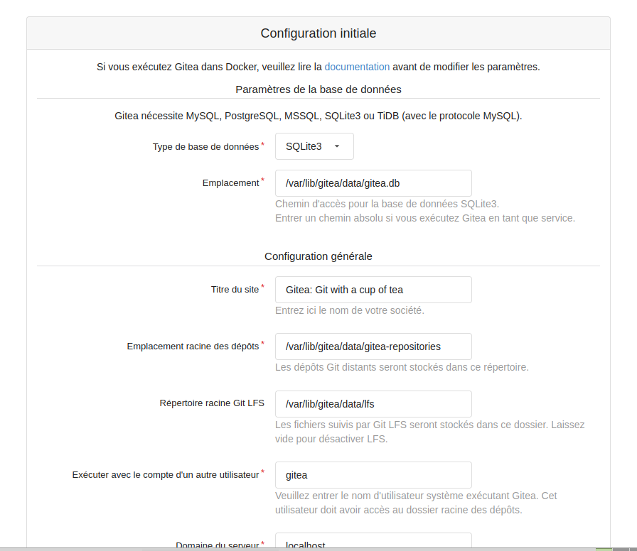
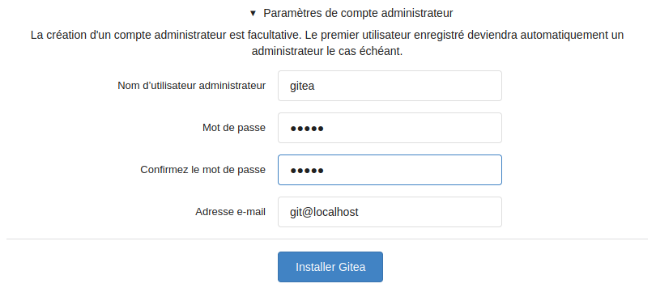
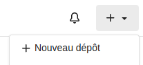
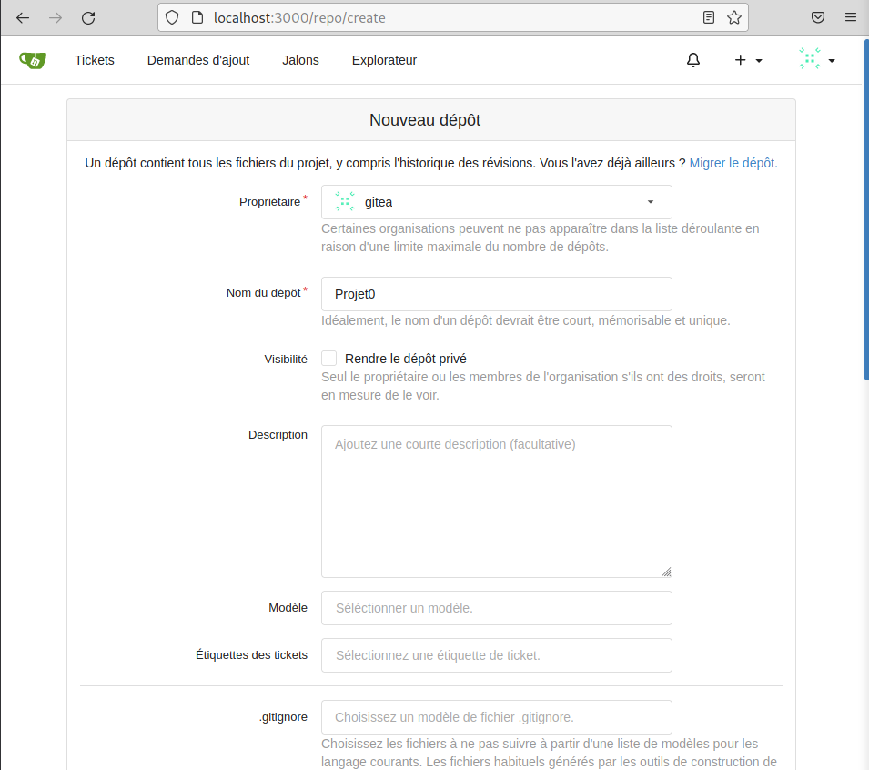
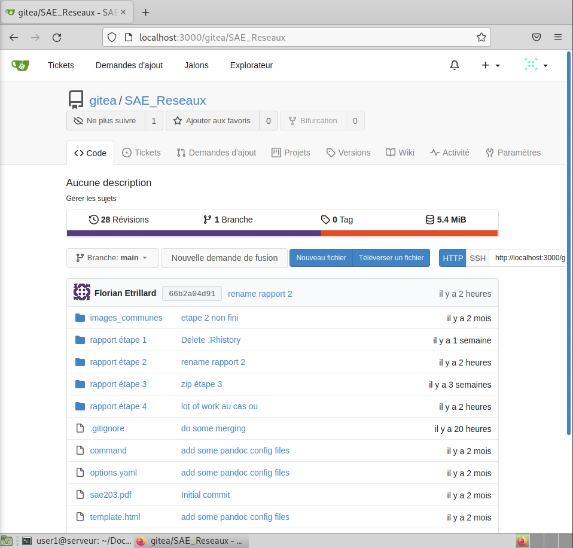

# Etape 4

## Réponses aux questions

### Qu'est ce que `Gitea` ?

`Gitea` est une solution d'hébergement de code publié sous licence MIT. C'est un outil en ligne permettant à plusieurs personnes de collaborer à la création de logiciel. `Gitea` a la particularité d'être auto-hébergeable et de pouvoir fonctionner sur des configurations peu performantes grâce à une faible consommation CPU et RAM.
[^what-is-gitea]

Il permet de :

- Gérer les version du code source grâce à git
- Gérer les droits sur les différents dépôts
- Créer et gérer des tickets pour signaler et traiter des bugs et répartir les tâches à accomplir
- Créer et gérer un wiki, pour documenter le code

[^what-is-gitea]: <https://docs.gitea.io/fr-fr/>, <https://debian-facile.org/atelier:git-df:gitea>, <https://gitea.io/en-us/>

### À quels logiciels bien connus dans ce domaine peut-on le comparer ?

`Gitea` est similaire à `GitHub` , `Gitlab` ou encore `Bitbucket`. [^comparaison-gitea]

[^comparaison-gitea]: <https://docs.gitea.io/fr-fr/>

### Qu’est-ce que `Markdown` ?

Tout comme le `HTML` ou le `LaTeX`,le `Markdown` est un langage de balisage, il permet le formatage du texte (`Markup languages`). Le `Markdown` se démarque particulièrement par sa simplicité. Les balises `Markdown` sont très visuelles et proches de leur signification.
Le `Markdown` présente un réel intérêt pour des personnes n'ayant pas de compétences particulières en informatique mais étant amenées à rédiger régulièrement des articles sur internet. [^markdown]

[^markdown]: <https://www.markdownguide.org/getting-started/>, <https://www.ionos.fr/digitalguide/sites-internet/developpement-web/markdown/>

### Comparer `Gitea` avec `gitweb` et `Gittyup` [^comparaison-gitea-gitweb-gittyup]

| Critère                                              | Gitea | Gitweb | Gittyup |
| ---------------------------------------------------- | :---: | :----: | :-----: |
| Open source et gratuit                               |   X   |   X    |    X    |
| License                                              |  MIT  | GPLv2  |   MIT   |
| Default web interface Git                            |       |   X    |         |
| Visualisation de l'historique du dépôt               |   X   |   X    |    X    |
| Visualisation des branches                           |   X   |   X    |    X    |
| Visualisation des commits                            |   X   |   X    |    X    |
| Multi-plateformes (Linux - Windows - MacOS)          |   X   |   X    |    X    |
| Type d'interface                                     |  web  |  web   | client  |
| Fonctionnalités Git (ex : commit / push / stash ...) |       |        |    X    |
| Activité / Contributions                             |  +++  |  +++   |   ++    |

*Gitea* est une solution d'hébergement de code fournie avec son interface web alors que *Gitweb* et *Gittyup* sont simplement des interfaces graphiques pour Git.
*Gitea* et *Gitweb* sont deux interfaces web de visualisation git alors que *Gittyup* est une interface client/serveur de visualisation et permettant d'effectuer des actions sans passer par les lignes de commandes, tels que `git commit`, `git push`, `git stash` ...

[^comparaison-gitea-gitweb-gittyup]: <https://git-scm.com/docs/gitweb>, <https://framalibre.org/content/gitea>, <https://github.com/go-gitea/gitea>, <https://fr.altapps.net/soft/gitweb?platform=windows>, <https://ubunlog.com/fr/gittyup-un-cliente-de-git-para-ver-y-administrar-el-historial-del-codigo>

## Installation de Gitea

Nous avons suivi les instructions de cette page de la [documentation officielle](https://docs.gitea.io/en-us/install-from-binary/) pour installer **Gitea** à partir des binaires.

### Mise à jour du système et des paquets

On utilise cette commande pour mettre à jour le système et les paquets, étant donné que nous les avons installés il y a quelque temps.

```bash
sudo apt update && sudo apt upgrade
```

### Téléchargement du fichier binaire

La documentation nous demande d'utiliser la commande suivante pour télécharger le binaire de **Gitea**. Elle précise qu'il faut remplacer l'URL par celle de la version de **Gitea** qui nous concerne (système, architecture, ,numéro de version) en la trouvant [ici](https://dl.gitea.io/gitea/). Pour nous pas besoin, la ligne de commande donnée concerne déjà la bonne version (Linux amd64).

```bash
wget -O gitea https://dl.gitea.io/gitea/1.16.7/gitea-1.16.7-linux-amd64
# wget => programme pour télécharger des fichiers depuis le web
# option -O pour signifier l'output (la sortie) de la commande, en l'occurrence, on lui demande de télécharger le fichier à partir de l'URL indiqué sous le nom gitea
```

Puis nous utilisons cette commande pour ajouter les droits d'exécution sur le fichier binaire.

```bash
chmod +x gitea
```

### Vérification de la signature du binaire

Il faut vérifier la signature du fichier téléchargé pour se protéger d'une éventuelle modification du binaire (ne change rien au processus d'installation, mais pour des raisons de sécurité, c'est une bonne pratique).

On utilisera ici GPG (*Gnu Privacy Guard*), qui est un outil permettant de vérifier la signature d'un fichier et son authenticité. Par défaut, il est conseillé d'utiliser la version de GPG installée avec la distribution afin d'éviter le problème de modification du binaire de GPG lui-même. [^GPG]

[^GPG]:Gnu Privacy Guard, <https://gnupg.org/>

```bash
# Télécharger le fichier de signature
wget -O gitea.asc https://dl.gitea.io/gitea/1.16.7/gitea-1.16.7-linux-amd64.asc

# Verifier la signature
gpg --keyserver keys.openpgp.org --recv 7C9E68152594688862D62AF62D9AE806EC1592E2
gpg --verify gitea.asc gitea
```

La vérification de la signature indique le texte suivant: "Good signature from "Teabot <teabot@gitea.io>" (en fr), nous pouvons donc continuer.

### Préparation de l'environnement

#### Vérification de la version de Git

```bash
git --version
# >>> git version 2.30.2
```

La version de `Git` est bien supérieure à 2.0 comme le demande la documentation, on peut donc continuer.

#### Création de l'utilisateur Gitea

```bash
adduser --system --shell /bin/bash --gecos 'Gitea with Git Version Control' --group --disabled-password --home /home/gitea gitea
```

##### Explication des paramètres [^adduser]

- `--system`: pour spécifier qu'il s'agit d'un compte système.  
- `--shell`: le shell utilisé pour exécuter le compte.  
- `--gecos`: permet d'enregistrer des information sur le compte (son nom par exemple, son numéro de tel...) [^GECOS].  
- `--group`: créer un groupe du même nom (et identifiant) que l'utilisateur et le placer dedans, car par défaut les utilisateurs système sont placés dans le groupe `nogroup`.  
- `--disabled-password`: pas de mot passe pour se connecter.  
- `--home`: pour indiquer le chemin du répertoire personnel de l'utilisateur.

Le dernier paramètre est le login de l'utilisateur. Pour garder une certaine cohérence nous avons décidé de nommer l'utilisateur `gitea` et non `git` comme l'indique la documentation, nous avons donc adapté toutes les autres instructions/commandes en conséquence.

[^GECOS]: <https://fr.wikipedia.org/wiki/Champ_Gecos>
[^adduser]: <https://manpages.debian.org/bullseye/adduser/adduser.8.fr.html>

#### Creation de la structure de répertoire requise

```bash
mkdir -p /var/lib/gitea/{custom,data,log}
chown -R gitea:gitea /var/lib/gitea/
chmod -R 750 /var/lib/gitea/
mkdir /etc/gitea
chown root:gitea /etc/gitea
chmod 770 /etc/gitea
```

##### Explications des répertoires [^linux-file-system]

- Le répertoire `/etc` a pour vocation de contenir des fichiers de configurations (dans le cas de Gitea, il y stocke le fichier `app.ini`).
- Le répertoire `/var/lib` contient les données persistantes des applications (dans le cas de Gitea, il y stocke les fichiers de logs et la base de donnée **SQLITE** par exemple).

[^linux-file-system]: <https://fr.wikipedia.org/wiki/Filesystem_Hierarchy_Standard>

##### Explication des commandes

- `mkdir`: pour créer un répertoire, avec l'option `-p`, `mkdir` créé tous les répertoires parents nécessaires sans générer d'erreurs. La syntaxe avec les accolades permet de créer trois répertoires en même temps avec les noms respectifs `custom`, `data` et `log`. [^mkdir]
- `chown`: pour changer le propriétaire et le groupe du répertoire. L'option `-R` permet d'appliquer le changement de manière récursive. A gauche des `:`, il s'agit du nouveau propriétaire, à droite du `:`, il s'agit du nouveau groupe. [^chown]
- `chmod`: permet de changer les permissions du répertoire. L'option `-R` permet d'appliquer le changement de manière récursive. [^chmod]

[^mkdir]: <https://manpages.debian.org/bullseye/mkdir.1.fr.html>
[^chown]: <https://manpages.debian.org/bullseye/chown.1.fr.html>
[^chmod]: <https://manpages.debian.org/bullseye/chmod.1.fr.html>

##### Signification des droits

Pour la commande `chmod`, la valeur `750` donne tous les droits au propriétaire (lecture, écriture, exécution; qui est maintenant `gitea`), seulement les droits de lecture et d’exécution au groupe, et aucun droits aux autres. On aurait également pu écrire `chmod -R a+rwx,g-w,o-rwx /var/lib/gitea`).  
La valeur `770` donne tous les droits à l'utilisateur (en l’occurrence `root`) et au groupe (`gitea`) et aucun aux autres. On aurait également pu écrire `chmod -R a+rwx,o-rwx /etc/gitea`).

On accorde **temporairement** les droits d'écriture à l'utilisateur `gitea` (via son groupe) pour que l'installateur web puisse écrire le fichier de configuration.

#### Configuration de la localisation du répertoire "de travail"

*Cette étape est simplement indiquée à titre informatif.*

Comme recommandé dans la documentation, nous utiliserons `Gitea` avec un service, il n'est donc pas nécessaire de configurer le répertoire de travail via la variable d'environnement `GITEA_WORK_DIR`, il sera précisé avec la variable `WorkingDirectory` dans le fichier du service.

Nous aurions dû utiliser la commande suivante dans le cas contraire:

```bash
export GITEA_WORK_DIR=/var/lib/gitea/
```

Le mot clé `export` permet de définir une variable d'environnement qui sera utilisée pour tous les processus lancés à partir du shell courant.

#### Copie du fichier binaire dans un répertoire global

On copie le fichier binaire dans un répertoire global, entre autres, pour les raisons expliquées [ici](#explications-sur-les-répertoires-linux-file-system).

```bash
cp gitea /usr/local/bin/gitea
```

##### Explications sur les répertoires [^linux-file-system]

- `/usr` est le répertoire qui contient des données qui ne sont pas absolument nécessaires au fonctionnement minimal du système (il contient la majorité des applications utilisateurs, utilitaires etc...)
- `/usr/local/` est un répertoire qui permet de stocker des données locales et spécifiques à l'ordinateur. Le répertoire `/bin` est celui qui contient les fichiers binaires des commandes.

### Mise en place du service

Comme recommandé dans la documentation, nous allons utiliser un *service* (aussi appelé *daemon*) Linux pour faire tourner Gitea (de manière très simplifiée, c'est une application qui s’exécute en arrière plan). Pour cela, nous utiliserons `systemd` et l'outil `systemctl`. [^systemd]

[^systemd]: <https://wiki.debian.org/systemd>

#### Téléchargement du fichier du service

```bash
wget https://raw.githubusercontent.com/go-gitea/gitea/main/contrib/systemd/gitea.service
cp gitea.service /etc/systemd/system/gitea.service
```

#### Modification du fichier du service

Pour respecter les contraintes imposées et certains changements, il faut que nous modifions quelques lignes du fichier de service.

```bash
nano --linenumbers /etc/systemd/system/gitea.service
```

```bash
User=gitea # l60
Group=gitea # l61
Environment=USER=gitea HOME=/home/gitea GITEA_WORK_DIR=/var/lib/gitea # l68
```

Avec **SQLITE**, pas besoin d'ajouter de dépendance de services pour les bases de données.  

A noter qu'il également possible de changer le port sur lequel le serveur web est accessible, en spécifiant l'option -p *ligne 66*, par exemple: `ExecStart=/usr/local/bin/gitea web --config /etc/gitea/app.ini -p 3001`.

#### Démarrage du service

Ces deux commandes permettent respectivement de lancer le service au démarrage du système et de l'activer immédiatement. [^systemd]

```bash
sudo systemctl enable gitea
sudo systemctl start gitea
```

### Installation Web

#### Configuration initiale

Gitea se lance par défaut sur le PORT 3000 [^gitea-command-line], nous nous rendons donc à l'adresse suivante: `http://localhost:3000`. Nous arrivons sur la page de configuration initiale de Gitea.  
Le seul paramètre qu'il nous est nécessaire de changer est la base de données utilisée (comme montré sur l'image ci dessous). Tout le reste est correct.



[^gitea-command-line]: <https://docs.gitea.io/fr-fr/command-line/>

#### Création du compte administrateur

Avant de valider la configuration, nous ne devons pas oublier de créer le compte administrateur ! (il est possible de le faire plus tard, mais il est préférable de le faire maintenant, le cas échéant, le premier utilisateur enregistré deviendrait le compte administrateur)



Il nous reste plus qu'à cliquer sur **Installer Gitea**.

### Modification des droits après l'installation Web

Après avoir accordé des droits en écriture à l'utilisateur `gitea` pour que l'installateur puisse écrire son fichier de configuration (comme expliqué en bas de [cette partie](#signification-des-droits)), il faut maintenant réappliquer des droits en lecture seule (*comme indiqué dans la documentation*).

```bash
chmod 750 /etc/gitea
chmod 640 /etc/gitea/app.ini
```

### Mise a jour potentielle

```bash
gitea --version
# >>> 1.16.7
```

La dernière version est `1.16.8`, on peut donc faire une mise à jour:

```bash
systemctl stop gitea
VERSION=$(wget --quiet https://dl.gitea.io/gitea/version.json -O - | cut -d \" -f 6)
wget -O /usr/local/bin/gitea https://dl.gitea.io/gitea/${VERSION}/gitea-${VERSION}-linux -amd64 && chmod +x /usr/local/bin/gitea
systemctl start gitea
```

- La commande `systemctl stop` permet d'arrêter le service Gitea avant de changer le binaire (puis après de le redémarrer avec `start`).
- `wget` télécharge de nouveau le binaire avec la dernière version de Gitea (indiquée dans la variable `VERSION`) et le remplace directement dans le répertoire `/usr/local/bin/gitea` (puis lui redonne les droits d'exécution).

## Utilisation basique

### Création d'un nouveau projet

Nous créons un nouveau projet/dépôt comme décrit avec les images suivantes:





Puis, dans le terminal (sous la session de `user1`):

```bash
mkdir Projet0 && cd Projet0
git init

touch README.md
echo "Ceci est un projet de test" >> README.md

git add README.md
git commit -m "first commit"
git remote add origin http://localhost:3000/gitea/Projet0.git
git push -u origin master
```

### Déposer des projets existants

Comme [précédemment](#création-dun-nouveau-projet), nous créons un nouveau projet/dépôt sur l'interface web de Gitea (nous l'appelons `SAE_Reseaux`). Ensuite, nous continuons avec les commandes suivantes:

```bash
# Copie du dossier du projet de la SAE 203 (Réseaux), puis:
git remote add origin http://localhost:3000/gitea/SAE_Reseaux.git
# >>> error: la distante origin existe déjà.

git push -u origin main
# >>> error: le spécificateur de référence source master ne correspond à aucune référence
# >>> error: impossible de pousser des références vers 'https://gitlab.univ-lille.fr/florian.etrillard.etu/s203.git'
```

Pour corriger le problème, il nous suffit de changer l'adresse URL de la remote (qui n'était pas la bonne: <https://gitlab.univ-lille.fr/florian.etrillard.etu/s203.git>):

```bash
git remote set-url origin http://localhost:3000/gitea/SAE_Reseaux.git
git push -u origin main
```

Tout marche parfaitement !  


